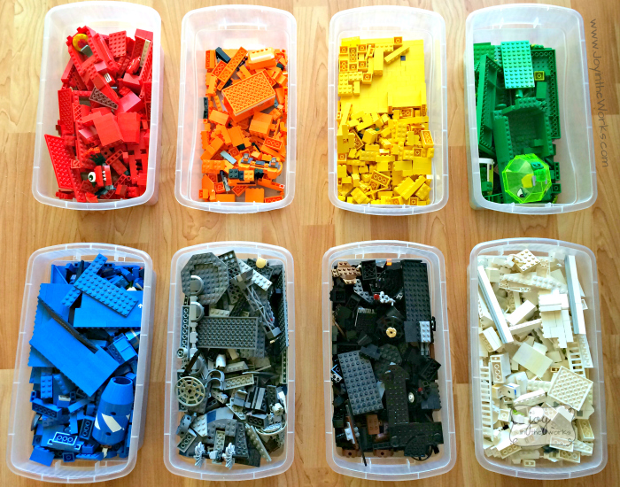

<!-- paginate: false -->


---

<!-- paginate: true -->

## Outline

1. Adding new types to the C++ standard
1. A simple new type: `dyn_optional`
1. Implementing `dyn_optional`
1. Introducing allocators
1. A Lego analogy for allocators
1. Adding allocator support to `dyn_optional`

---

## Adding new types to the C++ standard

We have been working on adding new value types `indirect` and `polymorphic` to
the C++ standard.

These two class templates are designed to be used for member data in composite
types.

- An instance of `indirect<T>` owns an object of class `T`.

- An instance of `polymorphic<T>` owns an object of class `T`
  or an object of a class derived from `T`.

We needed to add allocator support to `indirect` and `polymorphic`.
This talk covers the basics what we learnt along the way.

Work progresses at https://github.com/jbcoe/value_types.

---

## A simple new type: `dyn_optional`

Let's create a new type: `dyn_optional`.

`dyn_optional`, like `std::optional`, can hold a value or be empty.

When `dyn_optional` is non-empty, the value is stored in dynamic memory.

`dyn_optional` is unlikely to be useful for real code.

---

## Class definition

```cpp
template <typename T>
class dyn_optional {
  private:
    T* ptr;

  public:
    // Constructors
    dyn_optional();
    template <typename ...Us> dyn_optional(Us&& ...us);

    // Copy and move constructors
    dyn_optional(const dyn_optional& other);
    dyn_optional(dyn_optional&& other);

    // Assignment operators
    dyn_optional& operator=(const dyn_optional& other);
    dyn_optional& operator=(dyn_optional&& other);

    ...
```

---

```cpp
    ...

    // Observers
    operator bool() const;

    // Const accessors
    T const* operator->() const;
    T const& operator*() const;

    // Non-const accessors
    T* operator->();
    T& operator*();

    // Modifiers
    void reset();
    void swap(dyn_optional& other);

    // Destructor
    ~dyn_optional();
};
```

---

### Constructors

```cpp
template <typename T>
dyn_optional<T>::dyn_optional() : ptr(nullptr) {}
```

```cpp
template <typename T, typename ...Us>
dyn_optional<T>::dyn_optional(Us&& ...us) : ptr(new T(std::forward<Us>(us)...)) {}
```

---

## Copy and Move Constructors

```cpp
template <typename T>
dyn_optional<T>::dyn_optional(const dyn_optional<T>& other)  {
    if (other.ptr) {
        ptr = new T(*other.ptr);
    } else {
        ptr = nullptr;
    }
}
```

```cpp
template <typename T>
dyn_optional<T>::dyn_optional(dyn_optional<T>&& other)
    : ptr(std::exchange(other.ptr, nullptr)) {}
```

---

## Assignment Operators

```cpp
template <typename T>
dyn_optional<T>& dyn_optional<T>::operator=(const dyn_optional<T>& other) {
    if(this!=&other) {
        delete ptr;
        ptr = other.ptr? new T(*other.ptr) : nullptr;
    }
    return *this;
}
```

```cpp
template <typename T>
dyn_optional<T>& dyn_optional<T>::operator=(dyn_optional<T>&& other) {
    if(this!=&other) {
        delete ptr;
        ptr = std::exchange(other.ptr, nullptr);
    }
    return *this;
}
```

---

## Observers

```cpp
template <typename T>
dyn_optional<T>::operator bool() const  {
    return ptr != nullptr;
}
```

---

## Const Accessors

```cpp
template <typename T>
T const* dyn_optional<T>::operator->() const {
    return ptr;
}
```

```cpp
template <typename T>
T const& dyn_optional<T>::operator*() const {
    return *ptr;
}
```

---

## Non-const Accessors

```cpp
template <typename T>
T* dyn_optional<T>::operator->() {
    return ptr;
}
```

```cpp
template <typename T>
T& dyn_optional<T>::operator*() {
    return *ptr;
}
```

---

## Modifiers

```cpp
template <typename T>
void dyn_optional<T>::swap(dyn_optional<T>& other) {
    std::swap(ptr, other.ptr);
}
```

---

## Destructor

```cpp
template <typename T>
dyn_optional<T>::~dyn_optional() {
    delete ptr;
}
```

---

## Object creation and memory allocation

We used `new` to allocate memory for the value in `dyn_optional` and `delete` to deallocate it.

But what if we need finer control and more flexibility over memory allocation and deallocation,
or object creation and destruction?

---

## Allocators

_The basic purpose of an allocator is to provide a source of memory for a given
type, and a place to return that memory to once it is no longer needed._
– <small>Bjarne Stroustrup, The C++ Programming Language, 4th Edition</small>

Allocators provide a more granular way to manage memory than `new` and `delete`.

Allocators separate allocation and construction, and deallocation and destruction.

---

## What could we use an allocator for?

Stack allocation (avoid the heap)

Thread-local allocation (lock-free)

Local memory pools (cache-friendly)

Arena allocation (avoid fragmentation)

Debugging, instrumentation and testing (e.g. leak detection)

Relocatable data and shared memory (fancy pointers)

---

## The Lego Analogy


While working on `indirect` and `polymorphic`, we came up with an analogy that made us
re-think our code.

Imagine that we are building a Lego model.

The allocator is the box of Lego bricks that you use to build the model.

---

## A common pile of bricks

With the default allocator, bricks come from a common pile (heap).

Bricks come out of the pile to build a model and go back into the pile when a model is
taken apart.


---

## Sorted bricks

With a custom allocator, bricks come from a specific box.

Red bricks come out of the red box and go back into the red box.



---

## Extending models

When we add more complexity to the model, for instance another turret on our castle, we need
more bricks.

We can use a different box for the new bricks or we can use the same box as the original model.

With scoped allocators, a heirarchy of containers uses the same allocator as the outermost
container.


---

## Copying models

When we copy a model, we can use the same box of bricks or we can use a
different box.

Perhaps you are copying your friend's red house and need to use your supply of red bricks.

We must sure that when the models are taken apart, the bricks are returned to the correct box.


---

## A brief history of allocators

Allocators were added to C++ as part of the STL to allow custom memory management.

```cpp
std::vector<T, A=std::allocator<T>>
```

Before C++11, an allocator was a lightweight handle to a set of member functions
that affected how an object was constructed and destroyed, and how memory was
allocated and deallocated from some global resource.

C++11 introduced a more sophisticated model of allocators where allocators could
contain state and were interacted with through allocator traits.

---

## Adding an allocator to dyn_optional

We make an allocator part of `dyn_optional` and use the allocator to allocate
and deallocate memory.

A user could then specify the allocator they want to use when they create a
`dyn_optional`.

We add the allocator as a second template parameter to `dyn_optional`.

```cpp
template <typename T, typename Allocator = std::allocator<T>>
class dyn_optional;
```

---

## Allocator traits

Our class will interact with an allocator using allocator traits.

```cpp
Allocator allocator; // An instance of the allocator
using allocator_traits = std::allocator_traits<Allocator>;
using pointer = typename allocator_traits::pointer;

// Allocate memory and construct an object.
pointer memory = allocator_traits::allocate(allocator, 1);
allocator_traits::construct(allocator, std::to_address(memory), std::forward<Us>(us)...);

// Destroy an object and deallocate memory.
allocator_traits::destroy(allocator, std::to_address(memory));
allocator_traits::deallocate(allocator, memory, 1);
```

See https://en.cppreference.com/w/cpp/memory/allocator_traits for more information.

---

## Making `dyn_optional` allocator-aware

For scoped allocator support, a container needs to know if the objects it constructs need
to be constructed with an allocator.

Types can advertise their allocator support by adding the `using` declaration to their
class definition:

```cpp
using allocator_type = Allocator;
```

Note: this is not a convenience but a requirement for scoped allocator support.

---

## Allocator-extended constructors

When a type provides allocator support with `using allocator_type = Allocator`,
it is expected to provide allocator-extended constructors.

Allocator-extended constructors take either an allocator as the trailing argument:

```cpp
my_type(arg0, arg1, arg2, allocator);
```

or `std::allocator_arg_t` followed by an allocator as the leading arguments:

```cpp
my_type(std::allocator_arg_t, allocator, args...);
```

---

## Allocator propagation

When we copy or assign an instance of our allocator-aware type, what happens to
the allocator?

Allocator propagation is controlled by allocator traits:

```cpp
allocator_traits::select_on_container_copy_construction(const Allocator&);
```

This function (usually) returns a copy of an allocator or a default-constructed
allocator.

```cpp
allocator_traits::propagate_on_container_copy_assignment::value
allocator_traits::propagate_on_container_move_assignment::value
allocator_traits::propagate_on_container_swap::value
```

These traits are used to determine what to do with the allocator when copying,
moving or swapping.

---

## Class definition with allocators

Add an allocator template argument to `dyn_optional`.

Add allocator-extended constructors.

```cpp
template <typename T, typename Allocator = std::allocator<T>>
class dyn_optional {
private:
    [[no_unique_address]] Allocator allocator;
    T* ptr;

public:
    // Constructors
    dyn_optional();
    template <typename ...Us> dyn_optional(Us&& ...us);

    // Allocator-extended constructors
    dyn_optional(std::allocator_arg_t, Allocator const& a);
    template <typename ...Us> dyn_optional(std::allocator_arg_t, Allocator const& a, Us&& ...us);
```

`no_unique_address` is a C++20 attribute that ensures our object does not increase in size when the
allocator is stateless.

---

Add allocator-extended constructors.

```cpp
    // Copy and move constructors
    dyn_optional(const dyn_optional& other);
    dyn_optional(dyn_optional&& other);

    // Allocator-extended copy and move constructors
    dyn_optional(std::allocator_arg_t, Allocator const& a, const dyn_optional& other);
    dyn_optional(std::allocator_arg_t, Allocator const& a, dyn_optional&& other);

    // Assignment operators
    dyn_optional& operator=(const dyn_optional& other);
    dyn_optional& operator=(dyn_optional&& other);
```

---

No change to remaining member function interfaces.

```cpp
    // Observers
    operator bool() const;

    // Const accessors
    T const* operator->() const;
    T const& operator*() const;

    // Non-const accessors
    T* operator->();
    T& operator*();

    // Modifiers
    void reset();
    void swap(dyn_optional& other);

    // Destructor
    ~dyn_optional();
};
```

---

## `dyn_optional` Allocator-construction helper

```cpp
  using allocator_traits = std::allocator_traits<Allocator>;
  using pointer = allocator_traits::pointer;

  // ...

  template <typename... Us>
  static pointer construct(A alloc, Us&&... us) {
    pointer mem = allocator_traits::allocate(alloc, 1);
    try {
      allocator_traits::construct(alloc, std::to_address(mem), std::forward<Us>(us)...);
      return mem;
    } catch (...) {
      allocator_traits::deallocate(alloc, mem, 1);
      throw;
    }
  }
```

---

## `dyn_optional` Allocator-destruction helper

```cpp
  using allocator_traits = std::allocator_traits<Allocator>;
  using pointer = allocator_traits::pointer;

  // ...

  static void destroy(A alloc, pointer p) {
    allocator_traits::destroy(alloc, std::to_address(p));
    allocator_traits::deallocate(alloc, p, 1);
  }
```

---

## `dyn_optional<T,A>` Constructors with allocators

Use the allocator-construction helper in constructors.

```cpp
dyn_optional()
    : allocator(), ptr(construct(allocator)) {}

template <typename ...Us>
dyn_optional(Us&& ...us)
    : allocator(), ptr(construct(allocator, std::forward<Us>(us)...)) {}
```

---

## `dyn_optional<T,A>` Allocator-extended constructors

Use the allocator-construction helper in allocator-extended constructors.

```cpp
dyn_optional(std::allocator_arg_t, const A& a)
    : allocator(a), ptr(construct(allocator)) {}

template <typename ...Us>
dyn_optional(std::allocator_arg_t, const A& a, Us&& ...us)
    : allocator(a), ptr(construct(allocator, std::forward<Us>(us)...)) {}
```

---

## `dyn_optional<T,A>` Copy and move constructors

Use the allocator-construction helper in copy and move constructors.

Use `select_on_container_copy_construction` to copy (or not) the allocator.

```cpp
dyn_optional(const dyn_optional& other) :
    allocator(allocator_traits::select_on_container_copy_construction(other.allocator)),
    ptr(other.ptr ? construct(allocator, *other), nullptr) {}
```

```cpp
dyn_optional(dyn_optional&& other) :
    allocator(other.allocator)
    ptr(std::exchange(other.ptr, nullptr)) {}
```

Note: for the move constructor, the allocator is always copied.

---

## `dyn_optional<T,A>` Allocator-extended copy and move constructors

Use the allocator-construction helper in allocator-extended copy and move constructors.

```cpp
dyn_optional(std::allocator_arg_t, const A& a, const dyn_optional& other)  :
    allocator(allocator_traits::select_on_container_copy_construction(a)),
    ptr(other.ptr ? construct(allocator, *other), nullptr) {}
```

```cpp
dyn_optional(std::allocator_arg_t, const A& a, dyn_optional&& other) :
    allocator(other.allocator)
    ptr(std::exchange(other.ptr, nullptr)) {}
```

---

## `dyn_optional<T,A>` Copy assignment

Use `propagate_on_container_copy_assignment` to determine what to do with allocators.

```cpp
dyn_optional& operator=(const dyn_optional& other) {
    if(this!=&other) {
        const bool POCCA = allocator_traits::propagate_on_container_copy_assignment::value;
        if (!other) {
            if(ptr) destroy(allocator, ptr);
        } else {
            pointer tmp = construct(POCCA ? other.allocator : allocator, *other.p_);
            if (ptr) destroy(allocator, ptr);
            ptr = tmp;
        }
        if (POCCA) {
            allocator = other.allocator;
        }
    }
    return *this;
}
```

---

## `dyn_optional<T,A>` Move assignment

Use `propagate_on_container_move_assignment` to determine what to do with allocators.

```cpp
dyn_optional& operator=(const dyn_optional& other) {
    if(this!=&other) {
        const bool POMCA = allocator_traits::propagate_on_container_move_assignment::value;
        if (!other) {
            if(ptr) destroy(allocator, ptr);
        } else {
            if(allocator == other.allocator) {
                using namespace std;
                swap(ptr, other.ptr);
                destroy(other.allocator, other.ptr);
            }else{
                pointer tmp = construct(POCMA ? other.allocator : allocator, std::move(*other.p_));
                if (ptr) destroy(allocator, ptr);
                ptr = tmp;
            }
        }
        if (POCMA) {
            allocator = other.allocator;
        }
    }
    return *this;
}
```

---

## `dyn_optional<T,A>` Swap

Use `propagate_on_container_swap` to determine what to do with allocators.

```cpp
void swap(dyn_optional& other) {
    using namespace std;
    if constexpr (allocator_traits::propagate_on_container_swap::value) {
        swap(alloc_, other.alloc_);
        swap(p_, other.p_);
        return;
    } else /* constexpr */ {
        if (alloc_ == other.alloc_) {
            swap(p_, other.p_);
        } else {
            std::unreachable();
        }
    }
}
```

For collections, swap cannot invalidate iterators. We apply the same principle to `dyn_optional`.

If allocators are not propagated and do not compare equal, then behaviour is undefined.

---

## `dyn_optional<T,A>` Destructor

```cpp
~dyn_optional() {
  if (ptr) {
    destroy(allocator, ptr);
  }
}
```

---

## Slide-ware: do not use our example code

We have knowingly omitted:

- `assert`
- `requires`
- `static_assert`
- `noexcept`
- `constexpr`
- `explicit`
- `[[nodiscard]]` 🔥
- `// Any sort of helpful comments`

---

## Acknowledgements

Thanks to:

- My co-author Antony Peacock.

- Nina Ranns for fielding our regular questions on allocators.

- Joshua Berne for pair-debugging our early implementation of `polymorphic`.

- Neelofer Banglawala for her help with the slides and papers.

- Bob Steagall for his excellent cppcon 2017 talk on allocators.

- Assorted members of the C++ community for their ongoing work on allocators.

We have been the grateful recipients of a great deal of wisdom.

Mistakes are our own.
